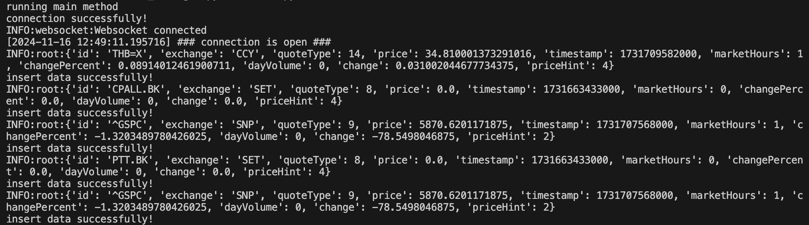
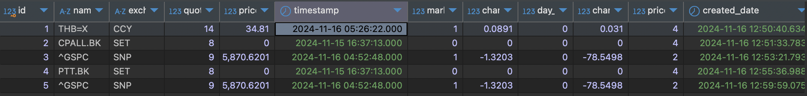

# This project for Quality Assuarance Coding Test (Pranworks)

## Project Title: Stock Price Tracker

## Description
This project is a real-time stock price tracker that allows users to monitor stock prices, including their changes and volume, for various tickers in a selected stock exchange.

## Installation

### Prerequisites
- Python 3.6 or higher
- Install the required dependencies via pip:

```
pip install -r requirements.txt
```

### Setup Instructions

Clone the repository:
```
git clone https://github.com/thantiwa153/QA_Coding.git
```
Navigate to the project directory:
```
cd QA_Coding
```
Install required packages:
```
pip install -r requirements.txt
```

### Usage
To run the program:

1. Open a terminal and navigate to the project directory.
2. Run the Python script:
```
python3 main.py
```
3. The program will start tracking the specified stock tickers and show real-time updates.

## Example

### Screenshot



